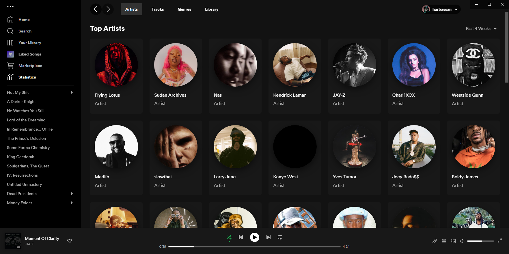
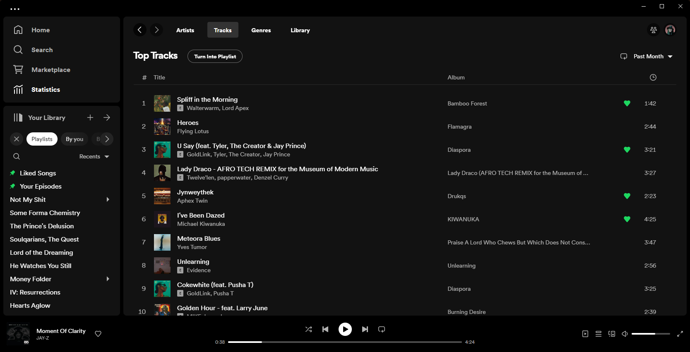
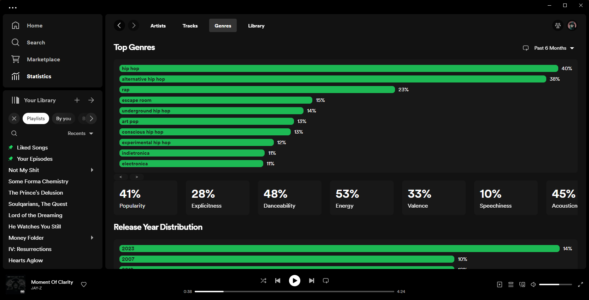
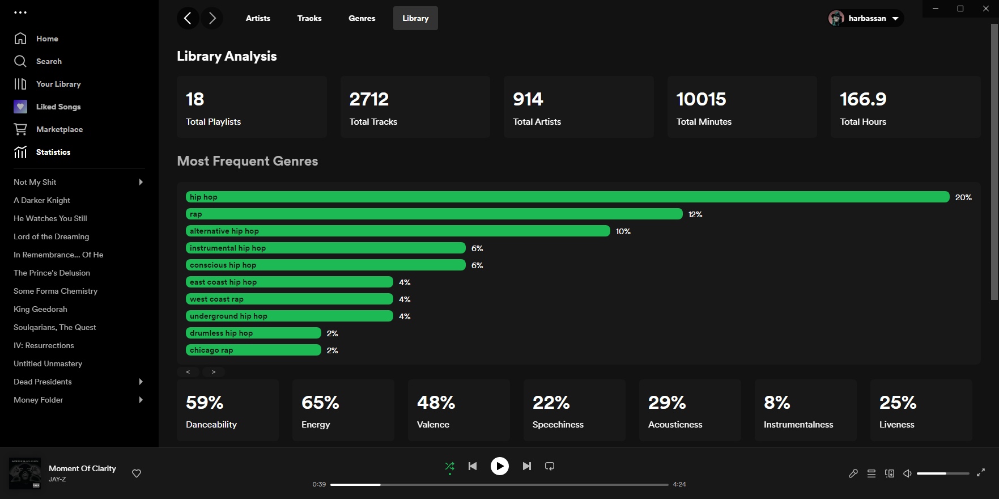
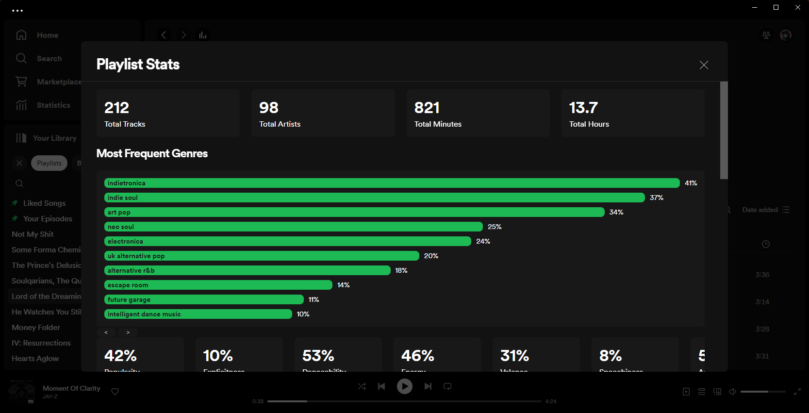

# Spicetify Stats

### A custom app that shows you your top artists, tracks, genres and an analysis of your whole library, including individual playlists.

---

### Top Artists



---

### Top Tracks



---

### Top Genres



---

### Library Analysis



---

### Playlist Analysis



---

### Manual Installation

Download the files in the [dist branch](https://github.com/harbassan/spicetify-stats/archive/refs/heads/dist.zip) and rename the folder to `stats`, and then place that folder into your `CustomApps` folder in the spicetify directory. It should be similair to this:

```
📦spicetify\CustomApps
 ┣ 📂marketplace
 ┣ etc...
 ┗ 📂stats
 ┃ ┣ 📂previews
 ┃ ┣ 📜extension.js
 ┃ ┣ 📜index.js
 ┃ ┣ 📜manifest.json
 ┃ ┣ 📜README.md
 ┃ ┗ 📜style.css
```

Then run these commands to apply:

```powershell
spicetify config custom_apps stats
spicetify apply
```

### Uninstallation

To disable the app run these commands:

```powershell
spicetify config custom_apps stats-
spicetify apply
```

If you want to completely remove the app just delete the `stats` folder after running the above commands.

---

If you have any questions or issues regarding the app open an issue on this repo. Please specify your spicetify version and installation method if you do so.

If you really like the app i'd be grateful if you liked the repo ❤️.
