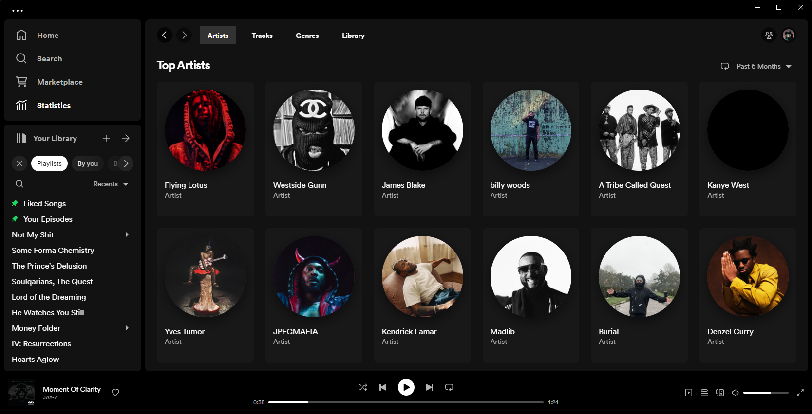
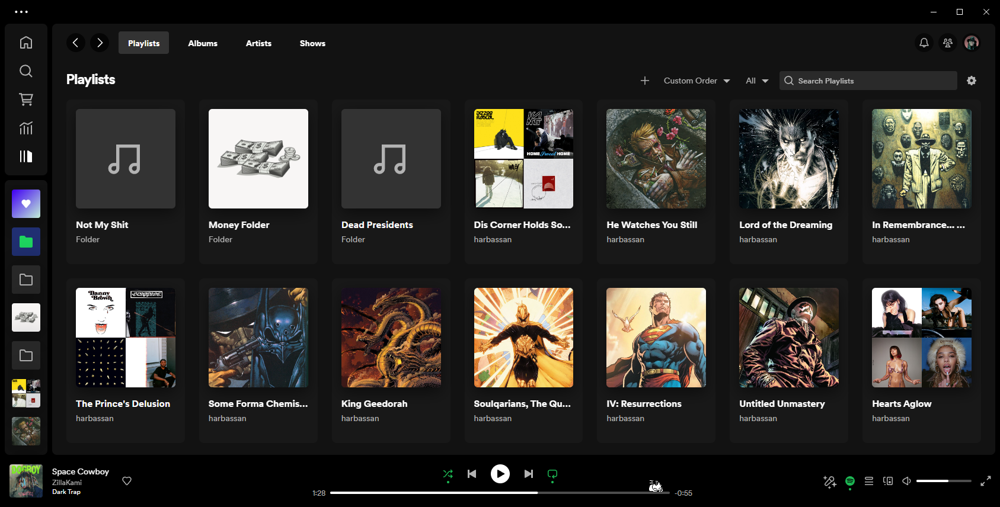

# Spicetify Apps

---

## [Statistics](projects/stats/README.md)

|                Top Artists                 |                Library Analysis                 |                Top Tracks                 |               |
| :----------------------------------------: | :---------------------------------------------: | :---------------------------------------: | :-----------: |
|  |  |  | And Much More |

---

## [Library](projects/library/README.md)

|                Full Pages                  |                Album Collections                |                Folder Images              |
| :----------------------------------------: | :---------------------------------------------: | :---------------------------------------: | 
|    |          |  |

---

The installation instructions are the same for both apps, and can be found in either's readme.

If you have any questions or issues regarding the apps open an issue on this repo. Please specify your spicetify version, and the app you're reffering to, e.g

[Statistics] Artist cards not rendering ...

If you really like the apps i'd be grateful if you liked the repo ❤️.
